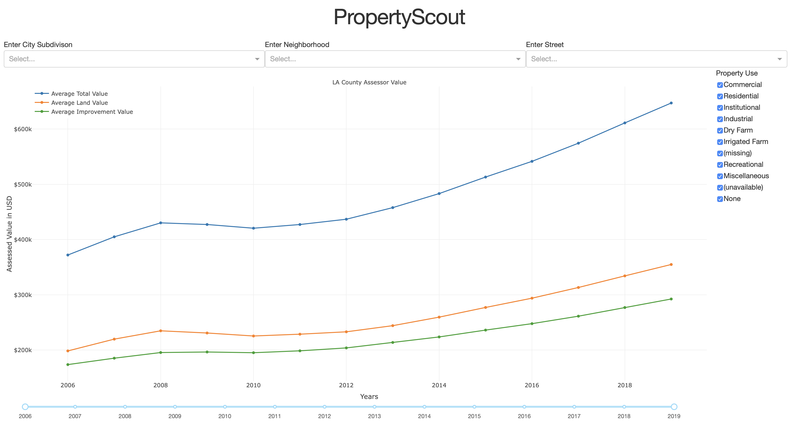
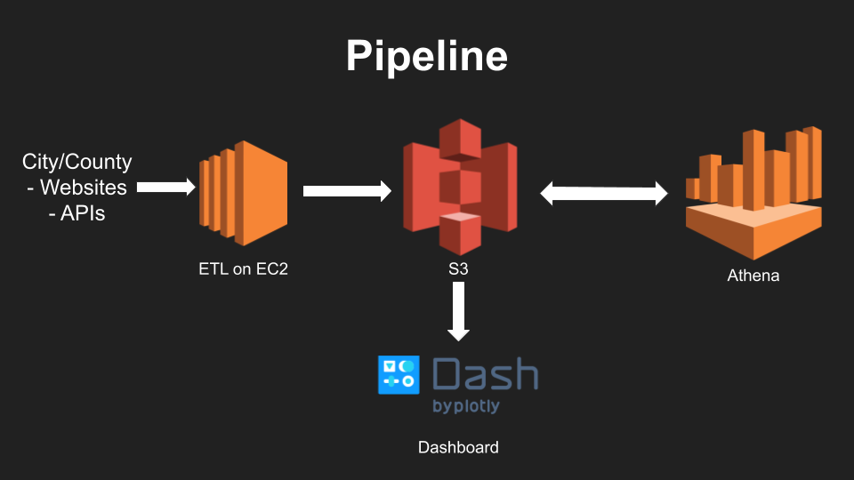

# Property Scout  

1-stop real estate record resource

## Pipeline

## Features

## Design

## Directory Structure

## Datasets
  
City | CSV API Endpoint |
--------------------|------------------|
Los Angeles | https://data.lacounty.gov/resource/9trm-uz8i.csv |
San Francisco | https://data.sfgov.org/resource/wv5m-vpq2.csv |
New York City | https://data.cityofnewyork.us/resource/yjxr-fw8i.csv |
Denver | https://data.colorado.gov/resource/msap-49q7.csv |
Austin | https://data.austintexas.gov/resource/8hvr-vyie.csv |
Las Vegas | https://opendata.arcgis.com/datasets/1a89b7b4de56414088c854c4f785e3e7_0.csv |

## Created by Matt Maatubang
Platform | Username |
--------------------|------------------|
Github | @matt-gm |  
Personal | mmaatubang.com | 
LinkedIn | linkedin.com/in/mmaatubang/ |