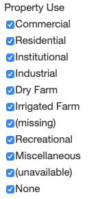
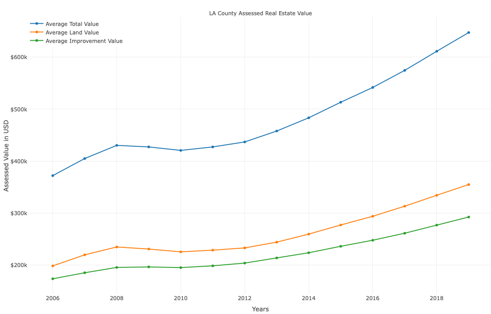
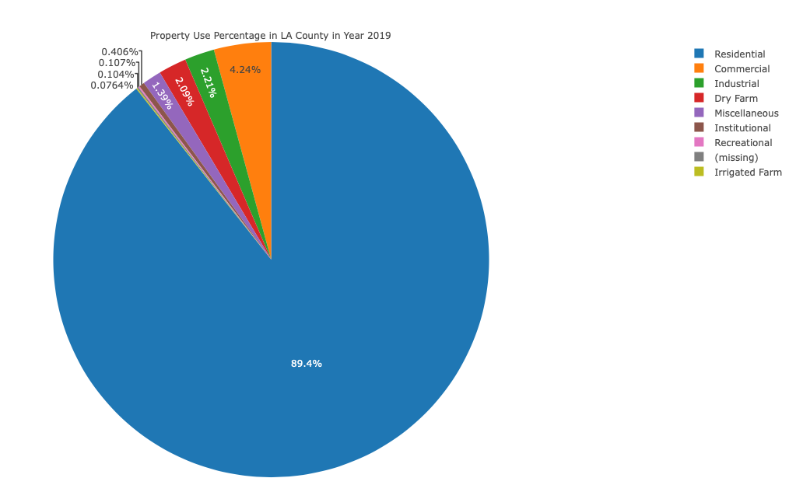
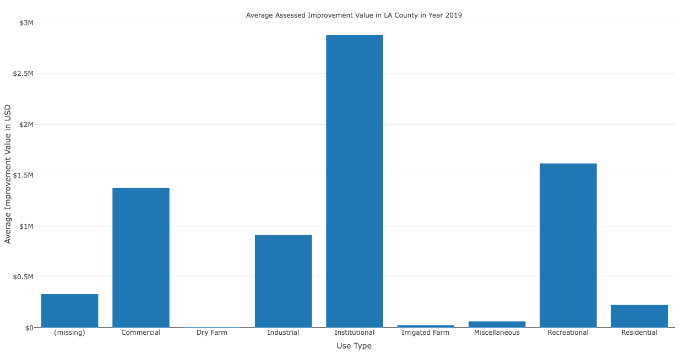

# Property Scout  

###1-stop real estate record resource.

## Pipeline

   

- ETL real estate records from 6 different datasets (see Datasets below).  
- Storage of raw and aggregated data in AWS S3.   
- Aggregation and data access via AWS Athena.   
- Visualization via Dash.   

## Dashboard Features

- View LA County Real Estate Assessor data from 2006-2019.    
- Filter data by geography: City, Neighborhood (ZIP Code), and Street.     
   
- Filter data by use type.   
  
- Filter data by record year.     
  
- Interactive time series, property count, and average improvement value charts.   
   
   
   

## Datasets
  
City | CSV API Endpoint |
--------------------|------------------|
Los Angeles | https://data.lacounty.gov/resource/9trm-uz8i.csv |
San Francisco | https://data.sfgov.org/resource/wv5m-vpq2.csv |
New York City | https://data.cityofnewyork.us/resource/yjxr-fw8i.csv |
Denver | https://data.colorado.gov/resource/msap-49q7.csv |
Austin | https://data.austintexas.gov/resource/8hvr-vyie.csv |
Las Vegas | https://opendata.arcgis.com/datasets/1a89b7b4de56414088c854c4f785e3e7_0.csv |

## Created by Matthew Maatubang
#### Insight Data Engineering Fellowship - Los Angeles 2020A
Platform | Username |
--------------------|------------------|
Github | @matt-gm |  
Personal | mmaatubang.com | 
LinkedIn | linkedin.com/in/mmaatubang/ |